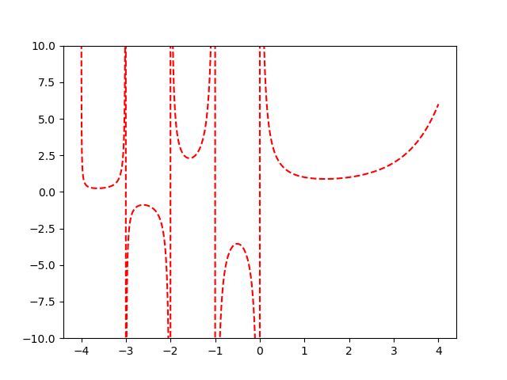
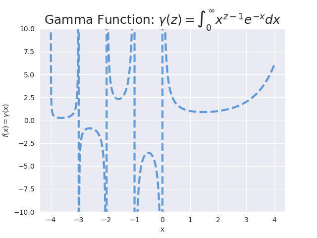

<!--
 Copyright (c) 2022 hs293go
 
 This software is released under the MIT License.
 https://opensource.org/licenses/MIT
-->

# Demo of using Pybind11 to plot with Matplotlib

This is a barebones demo of using `pybind11` to plot data with matplotlib in C++.

All code invoke a 3rd party API. No hand-rolled library is developed.

## Motivation

I've been using this technique since Aug 2021, by which time a very popular plottling library [matplotlib-cpp](https://github.com/lava/matplotlib-cpp) has been unmaintained for months, and [a PR I submitted for plotting generic constainers](https://github.com/lava/matplotlib-cpp/pull/276) has been ignored

## Highlights

Some highlights of using this *technique*, instead of bringing in a 3rd party plotting library

- Exploit embedded Python offered by`pybind11` to write C++ plotting code as you would python code
  - e.g. `import matplotlib.pyplot as plt` becomes `auto plt = py::module::import("matplotlib.pyplot")`
- Exploit embedded Python to bring in ANY matplotlib plotting function
  - e.g. `plt.attr("surf)` and `plt.attr("contour)` if you may
- Exploit the very flexible interface of `py::array` to plot a large variety of data structures.
  - [Full docs on the pybind11 site](https://pybind11.readthedocs.io/en/stable/advanced/pycpp/numpy.html)
- Uses native pybind11.
  - *If you are serious about python-C++ interop, you gotta have pybind11*

## The Code

Includes and boilerplate are omitted. See `src/demo_pyplot_readme.cpp` for details

``` C++
  // Embed the interpreter in the current scope
  py::scoped_interpreter interp{};

  // Import the module, similar to `import matplotlib.pyplot as plt`
  auto plt = py::module::import("matplotlib.pyplot");

  // Pybind11 does namespace/member resolution by `().attr("name")`.
  // Bring in `plot` etc. like `from matplotlib.pyplot import plot`
  auto plot = plt.attr("plot");
  auto show = plt.attr("show");
  auto ylim = plt.attr("ylim");
  auto savefig = plt.attr("savefig");

  // Use the following py::array ctor to map an existing buffer
  // https://pybind11.readthedocs.io/en/stable/advanced/pycpp/numpy.html
  py::array xv(xv_data.size(), xv_data.data());
  py::array yv(yv_data.size(), yv_data.data());

  // plot and show!
  plot(xv, yv, "r--");
  ylim(-10, 10);
  savefig("res/readme.png");
  show();
```

## Results

### The plots

Basic version of the plot. See `src/demo_pyplot_readme.cpp`



Detailed version of the plot, with seaborn and annotations. See `src/demo_pyplot_detailed.cpp`


